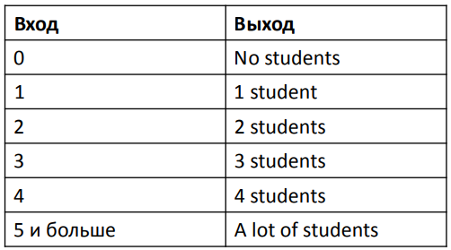

# Задача 3

Напишите скрипт на bash, который ожидает ввода с клавиатуры один
аргумент (целое число от 0 до бесконечности), который будет
обозначать число студентов в аудитории. В зависимости от значения
числа нужно вывести разные сообщения.
Соответствие входа и выхода должно быть таким:

